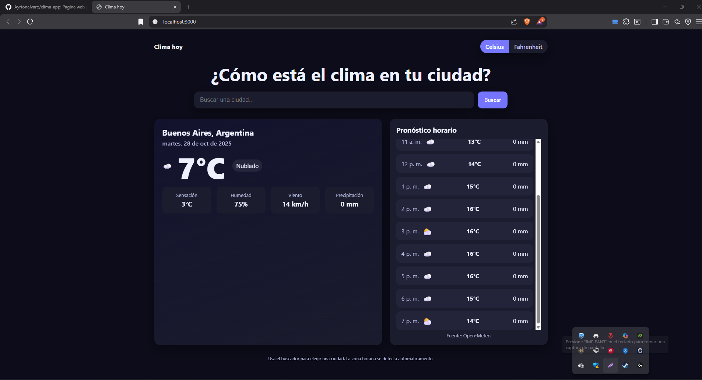
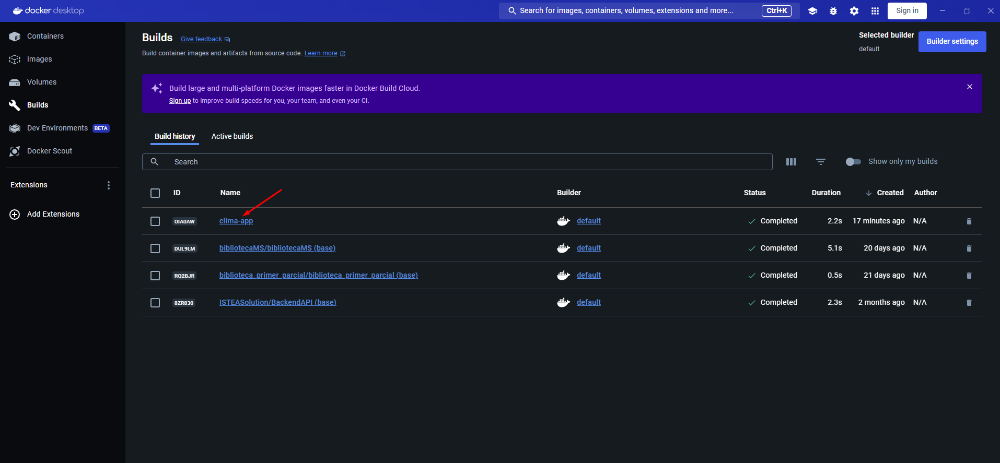

# 🌤️ Clima App (Node.js + Docker )

Trabajo práctico integrador **control de versiones con Git** y el ciclo completo de **contenedores Docker**.

La aplicación permite consultar el estado del clima y el pronóstico horario de diferentes ciudades, consumiendo la API pública de **Open-Meteo**. Está diseñada en HTML + CSS + JavaScript, servida por **Node.js + Express** dentro de un contenedor Docker.

---

## 🎯 Objetivos del trabajo práctico

- ✅ Gestionar versiones de código con **Git** y repositorio remoto (GitHub/GitLab/Bitbucket).
- ✅ Descargar y utilizar **imágenes base desde Docker Hub**.
- ✅ Construir y ejecutar **contenedores Docker personalizados** con una app propia.
- ✅ Documentar el proceso de forma **técnica y clara**.

---

## 🧩 Tecnologías utilizadas

- Node.js + Express (servidor web)
- HTML5, CSS3, JavaScript ES Modules (frontend)
- Docker Engine / Docker Desktop
- Open-Meteo API (geocodificación + pronóstico)
- Git + Repositorio remoto

---

## 📁 Estructura del proyecto

CLIMA-APP/
├─ public/index.html
├─ src/
│ ├─ api/ (llamadas a Open-Meteo)
│ ├─ services/ (estado global y unidades)
│ ├─ ui/ (DOM y renderizado)
│ ├─ utils/ (helpers)
│ └─ main.js
├─ styles/styles.css
├─ server.js
├─ package.json
├─ package-lock.json
├─ Dockerfile
└─ README.md

## Imagenes del proyecto

### Aplicación ejecutándose dentro del contenedor

